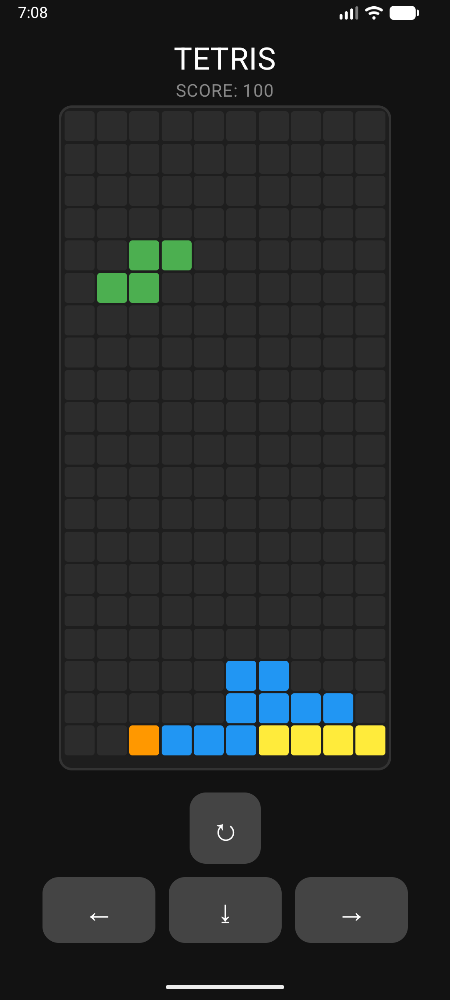

# Tetris



Классический тетрис, написанный на **Kotlin** с использованием **Jetpack Compose**

## Особенности
*   **Declarative UI**: Интерфейс полностью построен на Jetpack Compose (Material 3)
*   **Modern Architecture**: Использование MVVM (ViewModel) для четкого разделения логики и отображения
*   **Asynchrony**: Плавная работа игры и таймингов благодаря Kotlin Coroutines
*   **Adaptive Design**: Адаптивная сетка, корректно отображающаяся на экранах с разным соотношением сторон
*   **Performance-Driven**: Динамическое ускорение игрового цикла на основе набранных очков (адаптивный delay корутин)
*   **Zero Boilerplate**: Полностью кастомная реализация игровой логики без использования внешних игровых движков

## Stack
*   **Language**: Kotlin 2.2.10
*   **UI Framework**: Jetpack Compose (Material 3)
*   **Architecture**: MVVM + StateFlow
*   **Dependency Management**: Version Catalogs
*   **Build System**: Gradle (Kotlin DSL)

## Установка и запуск
1. Клонировать репозиторий
```bash
  git clone https://github.com/qsemyon/tetris
```
2. Открыть проект в Android Studio
3. Дождаться синхронизации Gradle и запустить проект на устройстве или эмуляторе (API 26+)